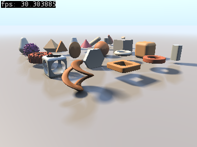
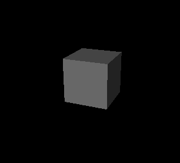
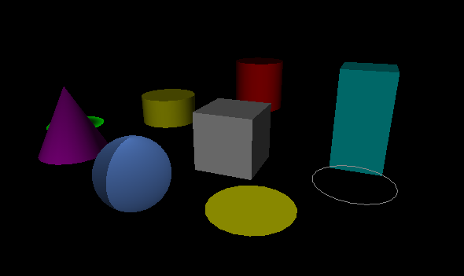
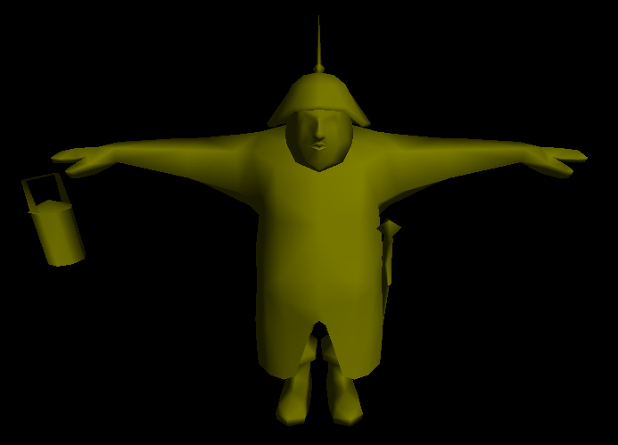
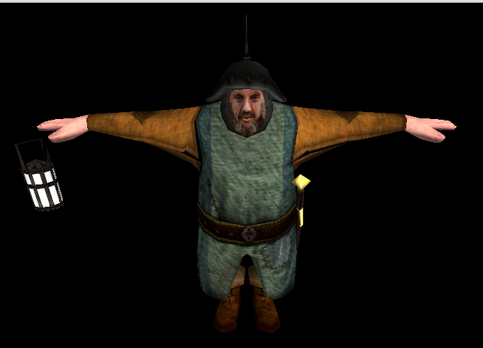
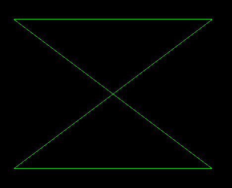
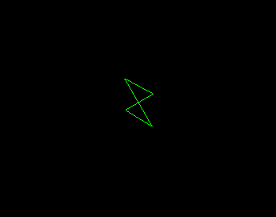
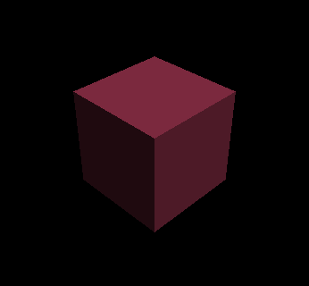

# projekt ogltest

Projekt zoskupuje niekoľko knižníc a ukážok uľahčujúcich prácu s grafikou pod opengl ako napr. knižnica `gl`, `gles2`, `agl`, a `otr`. Ogltest ďalej obsahuje dva adresáre `rawopengl` a `rawgles2` obsahujúce ukážky použitia knižníc OpenGL a OpenGL ES 2 s minimálnim použitím knižníc tretích strán a tiež adresár `playground` s ďalšími ukážkami.

Ďalšie projekty bullet, terrain, oglfont, android.


# ukážky

**wolf3d clone (android)** : strielačka v štýle Wolfenstein 3D s ohľadu prvej osoby implementovaná pomocou gles2 knižnice. Fizyka v hre je implementovaná pomocou knižnice *bullet* a priestorový zvuk v knižnici *openal*.


> TODO: top 5 (alebo 3) ukážky tu, ukážky chcem v štýle obrázku a popisného textu (do 10 slov) pod obrázkom zarovnanému v pravo ...


---


# obsah

[TOC]


# playground

Playground je zbierka programou implementovaných pomocou knižníc `gl`/`gles2`.


### shadertoy

Shadertoy program implementuje shadertoy.com fragment shader (gles2) player, takže je možné púštať shadertoy shader programi bez nutnosti pripojenia na sieť. Shadertoy naviše umožnuje pozastaviť a následne krokovať simuláciu pomocou kláves `p` (pause) a `.` (next frame).



Ovládanie: `O` - open shader file, `R` - reload shader program, `E` - edit shader program, `P` - pause program, `.` - next frame a `H` - show help.


# knižnica gl

Všetky gl ukážky bežia pod knižnicou glut a glew.

## Build

> **note**: not anymore buildable in Ubuntu 22.04 LTS due to 

```
libs/geometry/boost_geometry_adapt.hpp:12:11: fatal error: 'glm/detail/type_vec.hpp' file not found
        #include <glm/detail/type_vec.hpp>
```

error. To fix that we need to install older libglm (0.9.9.0) library, see `glm_tips:1-17` for an install guide.

To build gl we need to install following packages

	libglew-dev (2.0.0)

ďalej s adresára `ogltest/gl' stačí spustiť príkaz

	$ scons -j8

výsledkom kompilácie je statická knižnica `gl/libgl.a` a adresár
`test/` obsahujúcí jednotlivé ukážky (pozri [gl:ukážky](#gl:ukážky)).

pod kubuntu 16.04 potrebujem nasledujúce balíčky

	libglew-dev (1.13.0)
	libmagick++-dev (6.8.9.9)
	libassimp-dev (3.2)
	libfreetype6-dev (2.6.1)
	libpng12-dev (1.2.54)
	freeglut3-dev (2.8.1)
	libboost-all-dev (1.58)

a v prípade, že kompilujem pomocou clang-u aj balíček

	libomp-dev (3.7.0)


pod kubuntu 15.10 potrebujem nasledujúce balíčky

	libglew-dev (1.10.0-3),
	libmagick++-dev (6.8.9.9),
	libassimp-dev (3.0),
	libfreetype6-dev,
	libpng12-dev,
	libboost-dev (1.58),
	libboost-filesystem-dev (1.58),
	freeglut3-dev


## gl:štruktúra

	assets/
	gl/
	libs/
	test/
	readme
	SConstruct

kde adresár gl/ obsahuje zdrojové súbory pre knižnicu gl, assets/ sú
dátové súbory použiváne ukážkami a test/ obsahuje ukážky používajúce
knižnicu gl.

Knižnica gl obsahuje nasledujúce

### moduly scény

**camera.hpp**: modul implementujúci pohľad s kamery v scéne

**scene_object.hpp**: často používané objekty v scéne ako napr. osa
axis_object alebo light_object.

**controllers.hpp**: objekty scény umožnujúce užívateľskú interakciu ako napr.
free_look, free_camera, free_move a map_move.

Objekt typu free_move umožnuje implementovať pohyb kamery na základe
užívateľského vstupu (klávesnica).

**model.hpp**, **model_loader.hpp**: umožnuje prečítať model zo súboru (model
je v podstate zoznam mriežok a textúr modelu).

**animation.hpp**: implmentuje animovaný model, pozri ukážku
*gles2_/test/animated_model.cpp*.

**sprite_model.hpp**: model založený na sprite-och.


### gl moduly

**program.hpp**: glsl shader program

**mesh.hpp**: implementuje mesh štruktúru umožnujúcu prácu s mriežkou

**texture.hpp**: umožnuje prácu s textúrami

**phong.hpp**, **light.hpp**: osvetlenie scény, implementuje shader program a
rozhranie pre phongov osvetlovací model (pozri ukážku
*gles2_/test/textured_model.cpp*).

**frustum.hpp**: implementuje frustum culling (TODO: ukážka)

**gl.hpp**: spoločný header pre gl knižnicu.

	md5loader.hpp


### ui moduly

**window.hpp**: abstrakcia okna, konkrétne okenné implementácie sú potom v
moduloch glut_windoww.hpp. Modul window.hpp je čito abstraktný (tzn. nie je
závislý na gl implementácií).

Minimálna implementácia okna pre glfw knižnicu

```c++
// neaktualny kod

class glfw_layer : public window_layer
{
public:
	using parameters = window_layer::parameters;

	glfw_layer(parameters const & params);
	~glfw_layer();
	void main_loop_event();

	class user_input
	{
	public:
		void update() {}  //!< for internal use only

		// povinne rozhranie
		void mouse_motion(int x, int y) {}
		void mouse_passive_motion(int x, int y) {}
		void mouse_click(event_handler::button b, event_handler::state s, event_handler::modifier m, int x, int y) {}
		void mouse_wheel(event_handler::wheel w, event_handler::modifier m, int x, int y) {}
		void key_typed(unsigned char c, event_handler::modifier m, int x, int y) {}
		void key_released(unsigned char c, event_handler::modifier m, int x, int y) {}
		void touch_performed(int x, int y, int finger_id, event_handler::action a) {}
	};
};
```

loop je dizajnovaný takto

	input > update > display > in.update

!! moja oknová implementácia by mala získavať užívateľský vstup v input volaní.


**glut_window.hpp**: implementácia okna pod glut knižnicou.

**label.hpp**: kontrolka umožnujúca zobrazenie (ortho) textu.

**image.hpp**: kontrolka umožnujúca zobrazenie (ortho) obrázku.


### ostatné

**colors.hpp**: často používané farby

**default_shaders.hpp**: často používané zakladné programi

**shapes.hpp**: modul generujúci geometrické tvary napr. kocku, sféru, rovinu
ako mriežky.

**dtools.hpp**: podpora pre debugovanie

**resource.hpp**: správa zdrojov ako sú textúry, shader programi a pod. 

TODO: ukážka použitia ...

**texture_loader.hpp**: čítanie textúr z obrázkou (jpeg, png, ...).


## gl:ukážky

	animation_imp
	animation_md5
	animation_textured
	cam_transf
	dynamic_shading
	glut_pool_and_event_window
	joystick_play
	jpeg_texture
	loacal_space
	make_shapes
	mesh_custom_mode
	mipmapped_texture
	mipmaps
	model_view
	model_with_textures
	ortho
	phong
	phong_shader
	phong_shapes
	png_texture
	render_alpha
	simplest_window
	sprite_anim_model
	test_blur
	test_buffer
	test_font
	test_frustum
	test_geometry
	test_image
	test_mesh
	test_mesh_plane_xy
	test_normalmap
	test_offrender
	test_parallaxdisp
	test_parallaxnorm
	test_phong
	test_scene
	test_texrender
	test_texture
	test_texture_array
	test_texture_create
	test_texture_raw
	test_touch_button
	uniform_array


---
# knižnica gles2 (experimental)

Všetky gles2 ukážky bežia pod knižnicou GLFW3.


## gles2:ukážky

**test_camera.cpp**: ukážka použitia kamery



---

**test_shapes.cpp**: ukážka použitia gl::shape_generator generátora
geometrických tvarou




**test_user_input.cpp**: užívateľský vstup (klávesnica a myš) implementovaný
pomocou knižnice *glfw3* ako `ui::glfw3::user_input` (pozri
*glfw3_user_input.hpp*).

---

**test_glfw3.cpp**: integrácia užívateľského vstupu s ukážky *test_user_input*
do *glfw3* implementácie okna (pozri *glfw3_window.hpp*).

---


**bare_model.cpp**: abstrakcia modelu v akcii (bez textúr)



Ukážka bare_model vyrenderuje model uložený vo formáte MD5, model je nasvietený
pomocou flat_shaded_shader_source shaderom (diffuse zložka počítaná pomocou
normály povrchu a smeru svetla).

```c++
	// create model
	auto model_params = model_loader_parameters{};
	model_params.ignore_textures = true;
	model mdl = model_from_file(model_path, model_params);

	// render model
	mdl.render(prog);
```

---


**textured_model.cpp**: model s texurou v rátanie normálovej a výškovej mapy k
výpočtu osvetlenia phongovím modelom.



Zo svetlom sa manipuluje premennou typu `phong_light`, takto

```c++
phong_light _light = phong_light{normalize(vec3{2,3,5}), rgb::white, .85};
_light.apply(_prog);
```

a model samotný je vytvorený a vyrenderovaný podobným spôsobom ako v ukážke
*bare_model*.


TODO: ako vypada len otexturovany model, model s normalami a model s
výškovími mapami?


---


**animated_model.cpp**: MD5 animovaný model (animáciu počíta samotná grafická
karta)


---


## gles2:štruktúta

**touch_joystick**: implementuje joystick ovládač na dotykovom zariadení,
implementované v `touch_joystick_gles2.hpp` a `touch_joystick_gles2.cpp`.

\note Joystick bol použitý napr. v ukážke Wolf3.


---
# knižnica gles2

## gles2:kompilácia

K skompilovaniu knižnice pod ubuntu 18.04 potrebujeme nainštalovať nasledujúce
balíčky

	libpng-dev (1.6.34)
	glew
	libpng
	Magick++
	assimp
	freetype2


Skompilujem príkazom

	~/ogltest/gles2$ scons -j8

kde výsledkom kompilácie je statická knižnica gles2/libgles2.a a
adresár test/ obsahujúci jednotlivé ukážky.


## gles2:štruktúra

## gles2:ukážky

	gles2_texture
	gles2_texture_loader


---
# knižnica agl

Podpora OpenGL pre android. Modul obsahuje implementáciu triedy android_window (pozri agl/android_window.hpp) a java implementáciu pre OpenGL okno (org.libgl.view.GLSurfaceViewImpl).

## agl:štruktúra

	agl/
	android-template/
	libs/gl

## agl:ukážky

**android-template/**: Vykreslovanie pomocou OpenGL volaného v natívnej časti aplikácie.

---
# knižnica otr

Vykreslovanie terénu.

# otr:štruktúra

	buffer/
	current/
	logger/
	mesh/
	model/
	program/
	resource/
	scenegraph/
	twbar/
	utils/
	window/


# otr:ukážky

# otr:kompilácia

---
# adresár rawopengl

Ukážky použitia OpenGL API.

## rawopengl:štruktúra

## rawopengl:kompilácia

Skompilujem príkazom

	~/ogltest/rawopengl$ scons -j8

kde výsledkom kompilácie sú jednoduché ukážky použitia openGL API.


## rawopengl:ukážky

**lines**: ukážka renderuje čiary



---
**lines_in_scene**: ukážka renderuje čiary v priestore (v scene)



---
**program_modules**: ukážka použitia modulou pri vytvaraní GLSL programou

---
**simple_shading**: ukážka implementuje jednoduché tieňovanie



---
**test_transform**,
**test_transform_minimal**: transformácie objektou v scéne

---
**test_lighting**: implementácia phongov-ho osvetlovacieho modelu

---
**texture_image**,
**texture_storage**: renderovanie textúr pomocou glTexImage2D() a glTexStorage2D()

---
**uniform_array**: ukážka použitia poľa uniform premenných

---
**vao**: ukážka použitia VAO (Vertex Array Object)

---
**test_animation**: animovaná scéna

---
**test_screenshot**,
**test_screenshot_fbo**: uloženie (screenshot) aktuálneho frame-buffer-u

---
**test_buffer_copy_write**: ukážka použitia buffer-a s targetom COPY_WRITE

---
**test_triangle**,
**test_triangle_minimal**: vykreslí farebný trojuholník


---
# adresár rawgles2

Všetky rawgles2 ukážky bežia pod knižnicou GLFW3.

## rawgles2:ukážky

**hello.cpp**: základné okno v GKFW3 s podporou opengl es2 (gles2)

**triangle.cpp**: ukážka na obrazovku vykreslí trojuholník v gles2


## rawgles2:kompilácia

Skompilujem príkazom

	$ scons -j8
